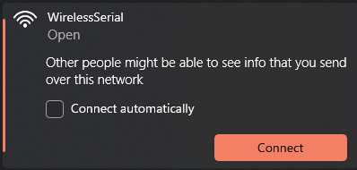
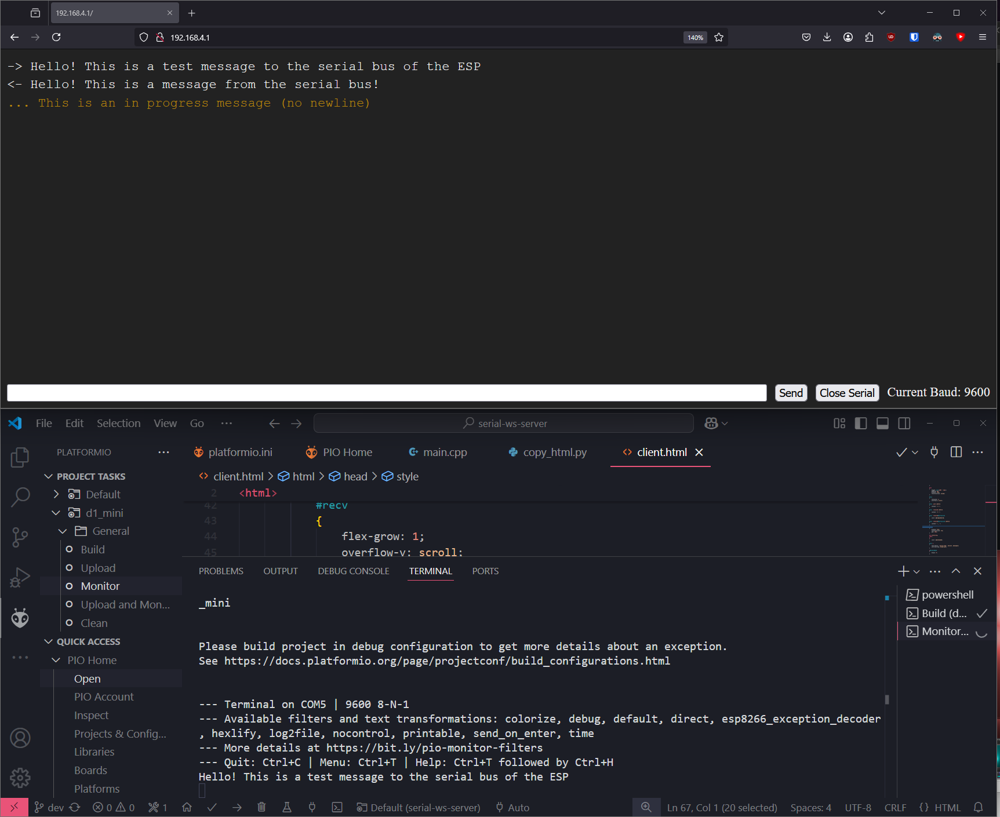

# Esp8266 Wireless Serial Server

Small application that sends received serial data to a webbrowser, and lets a webbrowser send text back over serial.

### Install

1. Clone this repository
1. Open it in platformio
1. Upload & Monitor from the platformio menu

### Usage

1. Connect to the WiFi AP
1. Go to the host IP (For me this was [http://192.168.4.1](http://192.168.4.1))
1. Set the baud rate, and you should be ready to send and recieve messages!

### Screenshot

